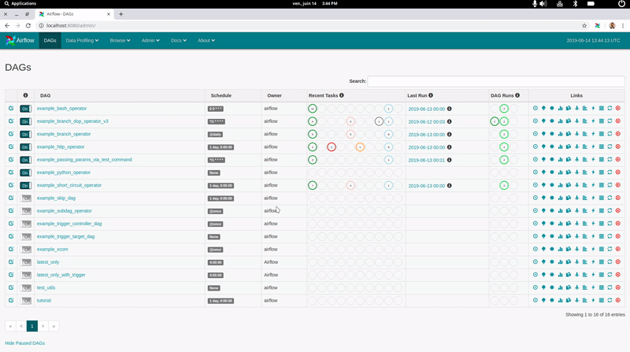

# Airflow Run Extension

Browser Extension automatically generating "Airflow run" and other commands from Airflow UI.

Compatible with Chrome and Firefox.

## Demo




## Installation

Clone repository where you want it, for example in your home.

```console
git clone https://github.com/rinzool/airflow-run-extension.git ~/
```

Build package
```console
cd airflow-run-extension
./build.sh
```

### Chrome
On Chrome, go to `chrome://extensions/`

Active _Developer Mode_ on the top right, then select _Load Unpack_ on the top left, and choose the subdirectory `airflow-run-extension/chrome`.

### Firefox

First, all source files must be zipped. Go to `./firefox/` and run 

```
zip -r airflox-extension.zip *
```

Then on Firefox, go to *add-ons* menu, choose _Install Add-on from file_ and select `firefox/airflow-extension.zip`

## How to use it

On Airflow user interface, click on extension button and a command will be automatically generated if possible.

Then the command is directly copied to clipboard

### Airflow run 

When you are on Airflow user interface in one of these two situations :
* The modal showing actions for a specific task is opened 
* The page is a _Task instance_ page (i.e. _Task Instance detail, Rendered Template, Log_ or _XCom_)

It will automatically generate `airflow run dag_id task_id execution_date`.

### Running Command

On the log page of a task, the extension will fetch the `Running command` called by the task if it exists.

### Highlight DAGs

It is possible to define a list of DAGs which will be highlighted on Airflow UI.

Open extension popup and then click on "_Settings_".

In _settings_ page, define a list of DAGs name in _csv_ (_e.g. dag1,dag2,dag3_) inthe textarea under "_List of dags to highlight_". 
Then on Airflow UI _"DAGs"_ page, if a DAG name contains one of the name defined in option, the line will be highlighted.

> It is possible to customize style applied to highlighted DAG's in _Option page_

## Updates

To get last updates :
* `git pull`
* `./build.sh`
* (**for firefox users only**) `cd firefox; zip -r firefox.zip *`
* Reload extension on your browser or re-import it for firefox users

## Author

[Quentin Nambot](mailto:quentin.nambot@grenoble-inp.org)
